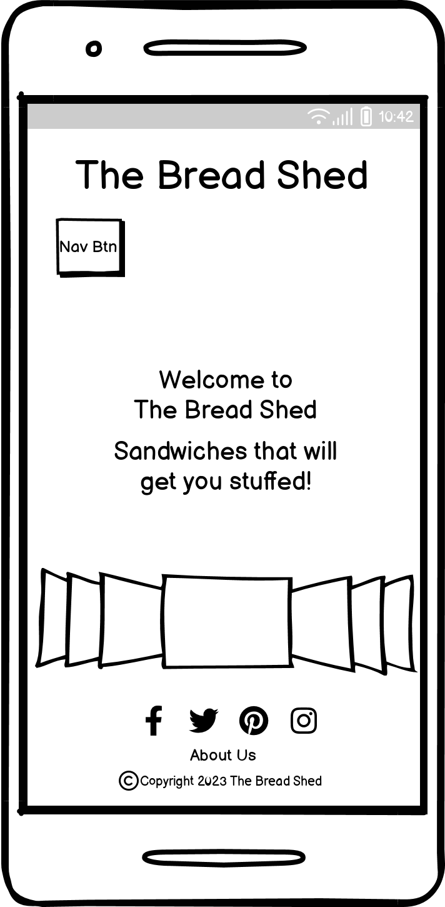
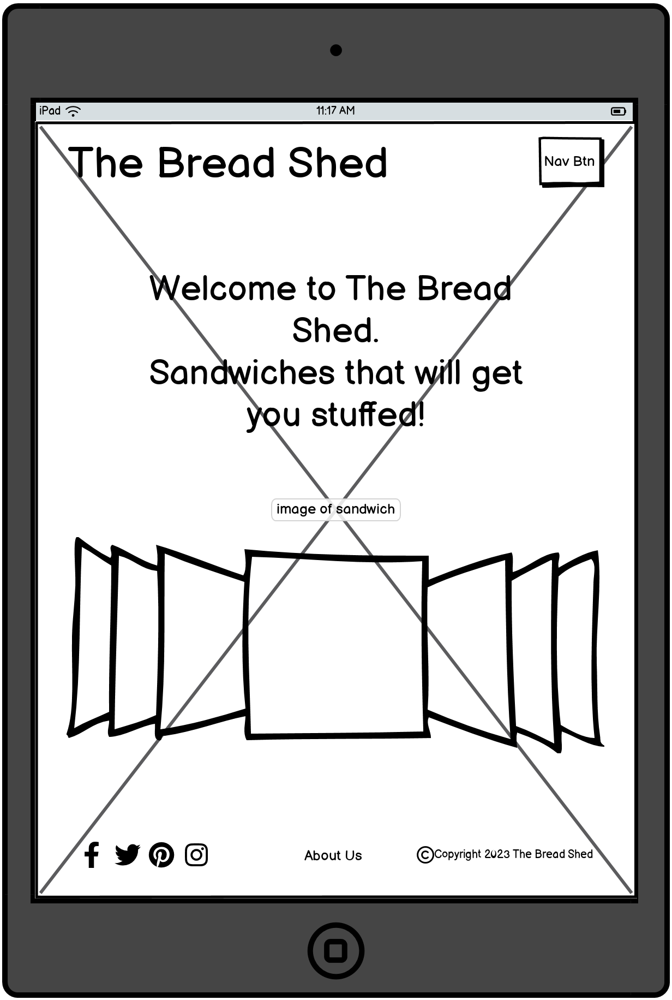
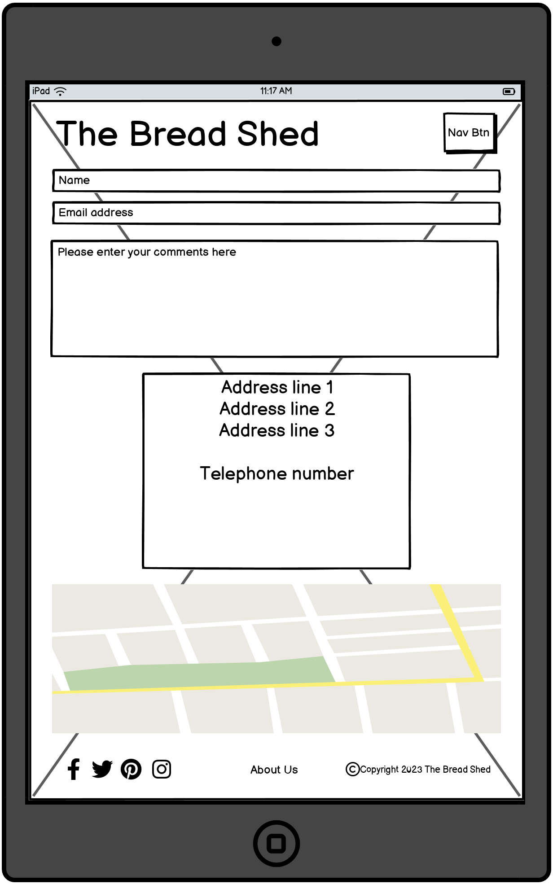
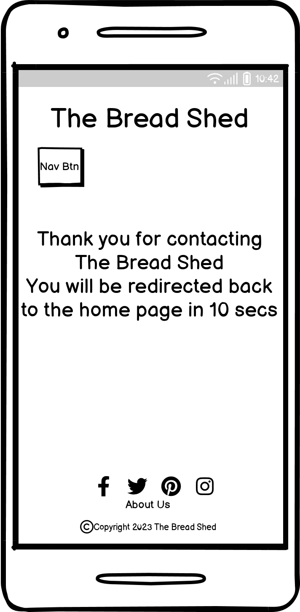
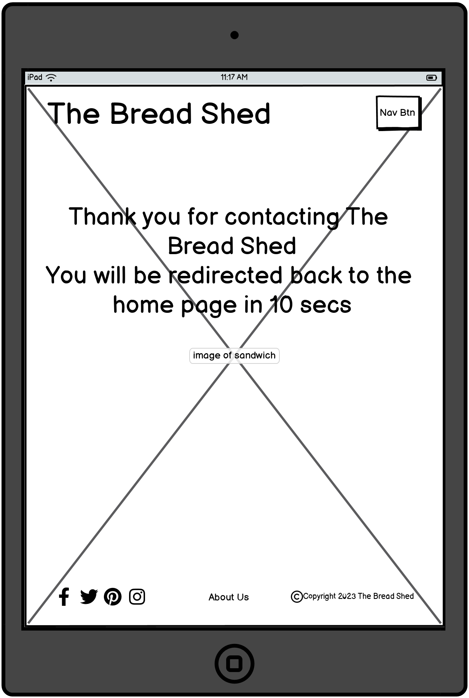
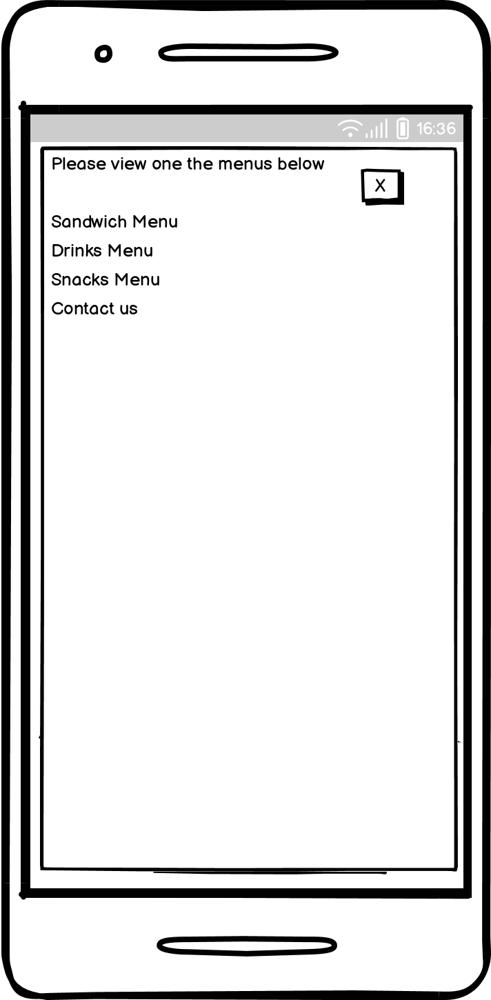
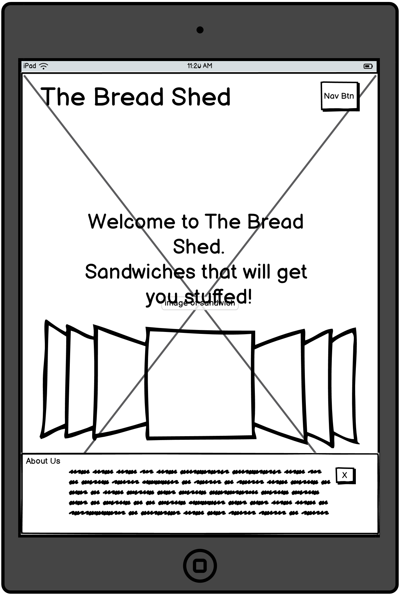

# THE BREAD SHED

- The Bread Shed is the bread and butter of everyones lunch, it is a sandwich shop that sells homemade sandwiches along with snacks and drinks.  
- It is a place where anyone can grab a quick bite to eat for breakfast or lunch.  
- The site is designed so that customers can view the menu and make a decision on what they might like to eat or drink before they arrive at the shop.  
- The customer can also phone their order through so that it is pre-made and ready for them upon arrival at the store.
- The Bread Shed website is designed with ease in mind and is divided into menu pages where the food items are seperated by type.
- The target audience for this website is anyone that is looking for something that is quick and easy to obtain and healthy to eat.
- Included below are two mockup images of The Bread Shed website.

## Mockup Screenshots

| Light | Dark |
| --- | --- |
|  |  |

## UX

- The design was created as a series of wireframes covering mobile, tablet and desktop to outlay the initial design thoughts and layout.  
- It was designed with ease of use in mind and mobile use at the forefront. This is so users can view what is on offer while out and about or not near to a computer.
- Once the wireframe was created, the web pages were built with a clean look and ease of navigation in mind, so you are never more than two clicks from a menu.

### Colour Scheme

- The colours chosen are Peach Yellow (#fbda92) and Gunmetal (#22333b).
- These two colours were chosen as they compliment each other along with the aesthetic of the background image. They are also subtle, easy on the eye and have a good contrasting visiblity with each other.

- `Hex code #fbda92` used for primary text.
- `Hex code #22333b` used for primary highlights.
- `Hex code #fbda92` used for secondary text.
- `Hex code #22333b` used for secondary highlights.
- `Hex code #22333b` used for tertiary text.
- `Hex code #fbda92` used for tertiary highlights.
- `Hex code #22333b` used for borders.
- `Hex code #fbda92ao` used for text backgrounds.
- `Hex code #22333b60` used for footer background.

### Typography

- Two fonts were chosen from Google fonts as follows.

- [Concert One](https://fonts.google.com/?query=concert+one) was used for the primary headers, titles and general text.
This font was chosen for it's bold and rounded aesthetic.

- [Shadows Into Light](https://fonts.google.com/?query=shadows) was used for all menu text and text entry fields.
This font was chosen for it's hand written aesthetic that I wanted to use for the menu items, portraying a hand written menu.

- [Font Awesome](https://fontawesome.com) icons were used throughout the site, specifically as the social media and copyright icons in the footer.

## User Stories

### New Site Users

- As a new site user, I would like to easily understand the main purpose of the site, so that I can learn more about what it has to offer.
- As a new site user, I would like to easily navigate through the site, so that I can easily make a choice from what is on offer.
- As a new site user, I would like to easily see what others think, so that I can decide if what is on offer will suit my tastes.
- As a new site user, I would like to easily be able to see their social media interaction, so that I can see if the have any publicised offers or loyalty schemes.

### Returning Site Users

- As a returning site user, I would like to find a good selection, so that I can try something different each time.
- As a returning site user, I would like to be able to make contact, so that I can make suggestions or post comments / testimonials.
- As a returning site user, I would like to good value, so that I can feel satisfied without breaking the bank.
- As a returning site user, I would like to wide range of drinks and snacks, so that I can compliment my meal choice.

### Site Admin

- As a site administrator, I should be able to easily navigate the site, so that I can make necessary alterations.
- As a site administrator, I should be able to find what is needed, so that I can update menus.
- As a site administrator, I should be able to maintain the site, so that I can remove any errors or bugs.
- As a site administrator, I should be able to keep the site running, so that I can limit the downtime and unavailability to customers.

## Wireframes

To follow best practice, wireframes were developed for mobile, tablet, and desktop sizes.
I've used [Balsamiq](https://balsamiq.com/wireframes) to design my site wireframes.

### Home Page Wireframes

| Mobile | Tablet | Desktop |
| --- | --- | --- |
|  |  |  |

### Menu Pages Wireframes

| Mobile | Tablet | Desktop |
| --- | --- | --- |
|  |  |  |

### Contact Page Wireframes

| Mobile | Tablet | Desktop |
| --- | --- | --- |
|  |  |  |

### Confirmation Page Wireframes

| Mobile | Tablet | Desktop |
| --- | --- | --- |
|  |  |  |

### Offcanvas Navbar Wireframes

| Mobile | Tablet | Desktop |
| --- | --- | --- |
|  |  |  |

### Offcanvas About Us Wireframes

| Mobile | Tablet | Desktop |
| --- | --- | --- |
|  |  |  |

## Features

### Existing Features

- **The Bread Shed Navigation Header**

  - The Bread Shed navigation header utilises the company name as a main link to the home page so whichever page is selected it is possible to navigate back to the home page by clicking on The Bread Shed navigation header. This is made possible by the first link at the top of the responsive navbar on all pages.

- **The Navigation Menu Button**

  - The navigation menu button is located in the top right corner of every page and enables the ability to navigate to any page on the site with two clicks (with exception to the confirmation page which can only be accessed by completing the contact form). The button enables an offcanvas element to scroll in from the right-hand side of the page and has a list of clickable links that navigate to the various pages of the site.

- **The Offcanvas Navigation Menu**

  - The offcanvas navigation menu scrolls in from the right-hand side of the page on all pages when the navigation menu button is clicked. This menu enables access to all pages in two clicks from the links located within. This offcanvas element also displays the store opening times. This utilises a bootstrap card element located within the offcanvas element.

- **The Social Media Navigation Links**

  - The social media navigation links located at the bottom of each page utilise Font Awesome 6 icons that have been wrapped in a link so that they are clickable. Each link is directed to it's relevant social media site and opens in a new browser tab so that navigation of the accessed page is not lost. Each social media link is highlighted when hovered over to indicate to the user that it is the one being selected.

- **The Compliments Carousel**

  - The compliments carousel in the lower center of the home page has been designed so that anyone visiting the site can instantly see the compliments left from previous customers. This instills confidence that the place is a reputable and desirable venue providing a great bite to eat for the hungry. The carousel is set to auto play and can be scrolled backward and forward using the arrows at each end if the viewer wants to override the default scroll time.

- **The About Us Offcanvas**

  - The about us off canvas element is triggered by clicking on About Us at the bottom of every page. This enables an offcanvas element to scroll up from the bottom of the page abd contains some information about the company.

### Future Features

⚠️⚠️⚠️⚠️⚠️ START OF NOTES (to be deleted) ⚠️⚠️⚠️⚠️⚠️

Do you have additional ideas that you'd like to include on your project in the future?
Fantastic! List them here!
It's always great to have plans for future improvements!
Consider adding any helpful links or notes to help remind you in the future, if you revisit the project in a couple years.

🛑🛑🛑🛑🛑 END OF NOTES (to be deleted) 🛑🛑🛑🛑🛑

- Title for future feature #1
  - Any additional notes about this feature.
- Title for future feature #2
  - Any additional notes about this feature.
- Title for future feature #3
  - Any additional notes about this feature.

## Tools & Technologies Used

⚠️⚠️⚠️⚠️⚠️ START OF NOTES (to be deleted) ⚠️⚠️⚠️⚠️⚠️

In this section, you should explain the various tools and technologies used to develop the project.
Make sure to put a link (where applicable) to the source, and explain what each was used for.
Some examples have been provided, but this is just a sample only, your project might've used others.
Feel free to delete any unused items below as necessary.

🛑🛑🛑🛑🛑 END OF NOTES (to be deleted) 🛑🛑🛑🛑🛑

- [HTML](https://en.wikipedia.org/wiki/HTML) used for the main site content.
- [CSS](https://en.wikipedia.org/wiki/CSS) used for the main site design and layout.
- [CSS :root variables](https://www.w3schools.com/css/css3_variables.asp) used for reusable styles throughout the site.
- [CSS Flexbox](https://www.w3schools.com/css/css3_flexbox.asp) used for an enhanced responsive layout.
- [CSS Grid](https://www.w3schools.com/css/css_grid.asp) used for an enhanced responsive layout.
- [JavaScript](https://www.javascript.com) used for user interaction on the site.
- [Python](https://www.python.org) used as the back-end programming language.
- [Git](https://git-scm.com) used for version control. (`git add`, `git commit`, `git push`)
- [GitHub](https://github.com) used for secure online code storage.
- [GitHub Pages](https://pages.github.com) used for hosting the deployed front-end site.
- [Gitpod](https://gitpod.io) used as a cloud-based IDE for development.
- [Bootstrap](https://getbootstrap.com) used as the front-end CSS framework for modern responsiveness and pre-built components.
- [Materialize](https://materializecss.com) used as the front-end CSS framework for modern responsiveness and pre-built components.
- [Flask](https://flask.palletsprojects.com) used as the Python framework for the site.
- [Django](https://www.djangoproject.com) used as the Python framework for the site.
- [MongoDB](https://www.mongodb.com) used as the non-relational database management with Flask.
- [SQLAlchemy](https://www.sqlalchemy.org) used as the relational database management with Flask.
- [PostgreSQL](https://www.postgresql.org) used as the relational database management.
- [ElephantSQL](https://www.elephantsql.com) used as the Postgres database.
- [Heroku](https://www.heroku.com) used for hosting the deployed back-end site.
- [Cloudinary](https://cloudinary.com) used for online static file storage.
- [Stripe](https://stripe.com) used for online secure payments of ecommerce products/services.
- [AWS S3](https://aws.amazon.com/s3) used for online static file storage.

## Testing

For all testing, please refer to the [TESTING.md](TESTING.md) file.

## Deployment

The site was deployed to GitHub Pages. The steps to deploy are as follows:

- In the [GitHub repository](https://github.com/boderg/the-bread-shed), navigate to the Settings tab,
- From the source section drop-down menu, select the **Main** Branch, then click "Save".
- The page will be automatically refreshed with a detailed ribbon display to indicate the successful deployment.

The live link can be found [here](https://boderg.github.io/the-bread-shed)

### Local Deployment

This project can be cloned or forked in order to make a local copy on your own system.

#### Cloning

You can clone the repository by following these steps:

1. Go to the [GitHub repository](https://github.com/boderg/the-bread-shed)  
2. Locate the Code button above the list of files and click it  
3. Select if you prefer to clone using HTTPS, SSH, or GitHub CLI and click the copy button to copy the URL to your clipboard
4. Open Git Bash or Terminal
5. Change the current working directory to the one where you want the cloned directory
6. In your IDE Terminal, type the following command to clone my repository:
    - `git clone https://github.com/boderg/the-bread-shed.git`
7. Press Enter to create your local clone.

Alternatively, if using Gitpod, you can click below to create your own workspace using this repository.

Please note that in order to directly open the project in Gitpod, you need to have the browser extension installed.
A tutorial on how to do that can be found [here](https://www.gitpod.io/docs/configure/user-settings/browser-extension).

#### Forking

By forking the GitHub Repository, we make a copy of the original repository on our GitHub account to view and/or make changes without affecting the original owner's repository.
You can fork this repository by using the following steps:

1. Log in to GitHub and locate the [GitHub Repository](https://github.com/boderg/the-bread-shed)
2. At the top of the Repository (not top of page) just above the "Settings" Button on the menu, locate the "Fork" Button.
3. Once clicked, you should now have a copy of the original repository in your own GitHub account!

### Local VS Deployment

⚠️⚠️⚠️⚠️⚠️ START OF NOTES (to be deleted) ⚠️⚠️⚠️⚠️⚠️

Use this space to discuss any differences between the local version you've developed, and the live deployment site on GitHub Pages.

🛑🛑🛑🛑🛑 END OF NOTES (to be deleted) 🛑🛑🛑🛑🛑

## Credits

⚠️⚠️⚠️⚠️⚠️ START OF NOTES (to be deleted) ⚠️⚠️⚠️⚠️⚠️

In this section you need to reference where you got your content, media, and extra help from.
It is common practice to use code from other repositories and tutorials,
however, it is important to be very specific about these sources to avoid plagiarism.

🛑🛑🛑🛑🛑 END OF NOTES (to be deleted) 🛑🛑🛑🛑🛑

### Content

⚠️⚠️⚠️⚠️⚠️ START OF NOTES (to be deleted) ⚠️⚠️⚠️⚠️⚠️

Use this space to provide attribution links to any borrowed code snippets, elements, or resources.
A few examples have been provided below to give you some ideas.

Ideally, you should provide an actual link to every resource used, not just a generic link to the main site!

🛑🛑🛑🛑🛑 END OF NOTES (to be deleted) 🛑🛑🛑🛑🛑

| Source | Location | Notes |
| --- | --- | --- |
| [Markdown Builder](https://traveltimn.github.io/markdown-builder) | README and TESTING | tool to help generate the Markdown files |
| [Chris Beams](https://chris.beams.io/posts/git-commit) | version control | "How to Write a Git Commit Message" |
| [W3Schools](https://www.w3schools.com/howto/howto_js_topnav_responsive.asp) | entire site | responsive HTML/CSS/JS navbar |
| [W3Schools](https://www.w3schools.com/howto/howto_css_modals.asp) | contact page | interactive pop-up (modal) |
| [W3Schools](https://www.w3schools.com/css/css3_variables.asp) | entire site | how to use CSS :root variables |
| [Flexbox Froggy](https://flexboxfroggy.com/) | entire site | modern responsive layouts |
| [Grid Garden](https://cssgridgarden.com) | entire site | modern responsive layouts |
| [StackOverflow](https://stackoverflow.com/a/2450976) | quiz page | Fisher-Yates/Knuth shuffle in JS |
| [YouTube](https://www.youtube.com/watch?v=YL1F4dCUlLc) | leaderboard | using `localStorage()` in JS for high scores |
| [YouTube](https://www.youtube.com/watch?v=u51Zjlnui4Y) | PP3 terminal | tutorial for adding color to the Python terminal |
| [strftime](https://strftime.org) | CRUD functionality | helpful tool to format date/time from string |
| [WhiteNoise](http://whitenoise.evans.io) | entire site | hosting static files on Heroku temporarily |

### Media

⚠️⚠️⚠️⚠️⚠️ START OF NOTES (to be deleted) ⚠️⚠️⚠️⚠️⚠️

Use this space to provide attribution links to any images, videos, or audio files borrowed from online.
A few examples have been provided below to give you some ideas.

If you're the owner (or a close acquaintance) of all media files, then make sure to specify this.
Let the assessors know that you have explicit rights to use the media files within your project.

Ideally, you should provide an actual link to every media file used, not just a generic link to the main site!
The list below is by no means exhaustive. Within the Code Institute Slack community, you can find more "free media" links
by sending yourself the following command: `!freemedia`.

🛑🛑🛑🛑🛑 END OF NOTES (to be deleted) 🛑🛑🛑🛑🛑

| Source | Location | Type | Notes |
| --- | --- | --- | --- |
| [Pexels](https://www.pexels.com) | entire site | image | favicon on all pages |
| [Lorem Picsum](https://picsum.photos) | home page | image | hero image background |
| [Unsplash](https://unsplash.com) | product page | image | sample of fake products |
| [Pixabay](https://pixabay.com) | gallery page | image | group of photos for gallery |
| [Wallhere](https://wallhere.com) | footer | image | background wallpaper image in the footer |
| [This Person Does Not Exist](https://thispersondoesnotexist.com) | testimonials | image | headshots of fake testimonial images |
| [Audio Micro](https://www.audiomicro.com/free-sound-effects) | game page | audio | free audio files to generate the game sounds |
| [Videvo](https://www.videvo.net/) | home page | video | background video on the hero section |
| [TinyPNG](https://tinypng.com) | entire site | image | tool for image compression |

### Acknowledgements

⚠️⚠️⚠️⚠️⚠️ START OF NOTES (to be deleted) ⚠️⚠️⚠️⚠️⚠️

Use this space to provide attribution to any supports that helped, encouraged, or supported you throughout the development stages of this project.
A few examples have been provided below to give you some ideas.

🛑🛑🛑🛑🛑 END OF NOTES (to be deleted) 🛑🛑🛑🛑🛑

- I would like to thank my Code Institute mentor, [Tim Nelson](https://github.com/TravelTimN) for their support throughout the development of this project.
- I would like to thank the [Code Institute](https://codeinstitute.net) tutor team for their assistance with troubleshooting and debugging some project issues.
- I would like to thank the [Code Institute Slack community](https://code-institute-room.slack.com) for the moral support; it kept me going during periods of self doubt and imposter syndrome.
- I would like to thank my partner (John/Jane), for believing in me, and allowing me to make this transition into software development.
- I would like to thank my employer, for supporting me in my career development change towards becoming a software developer.
