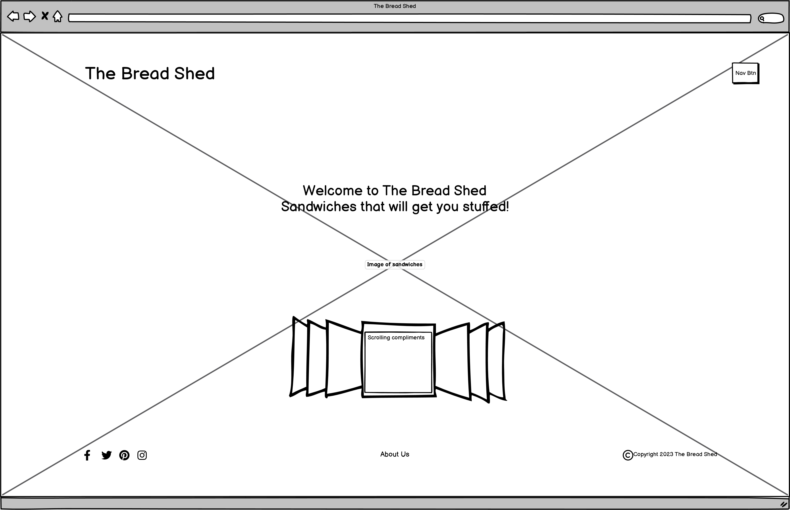
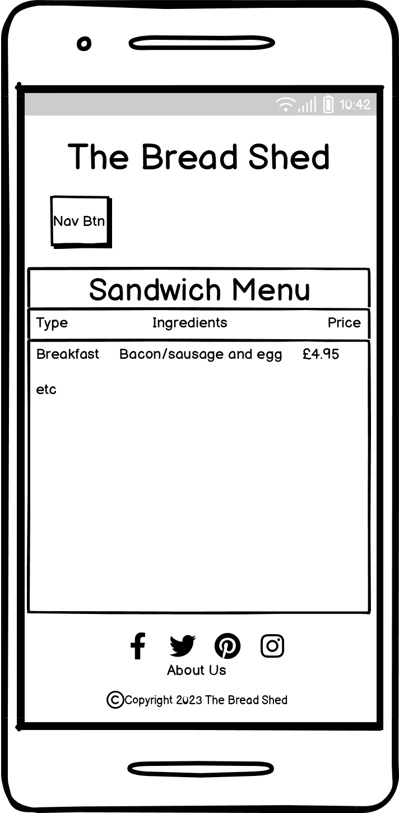
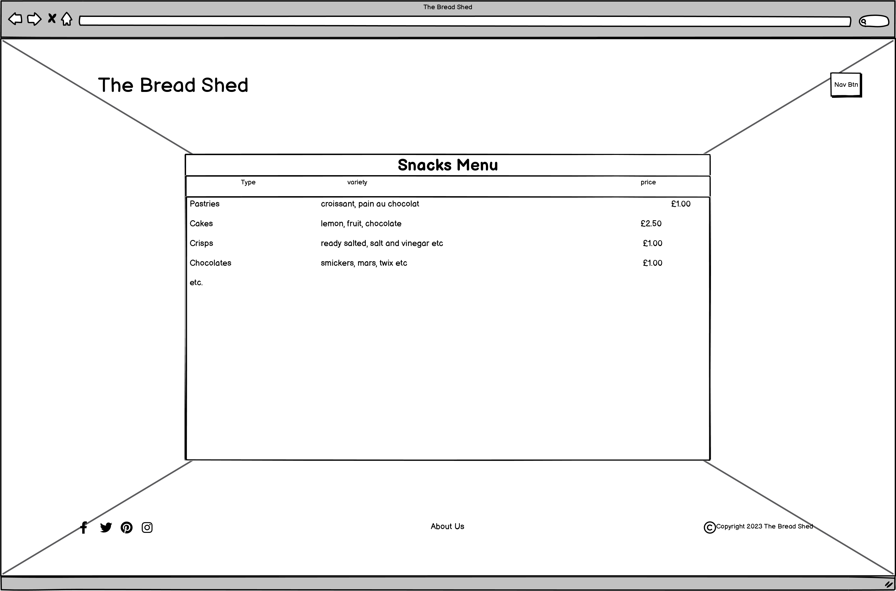
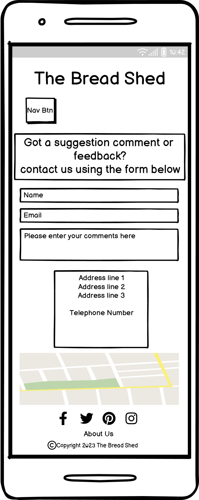
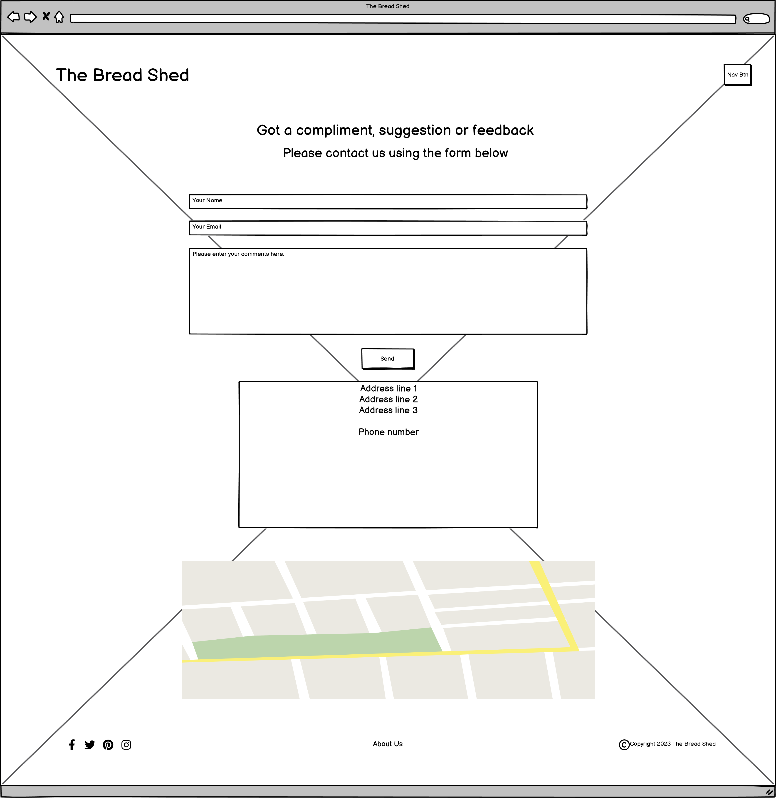
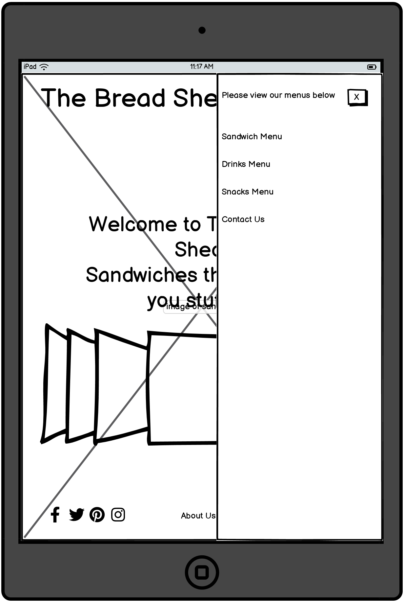
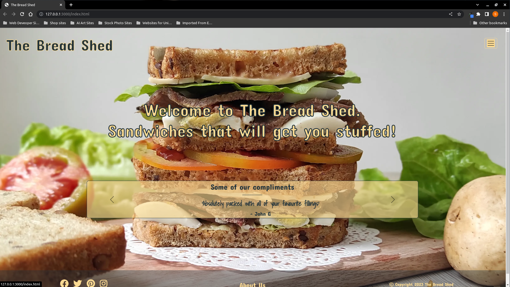
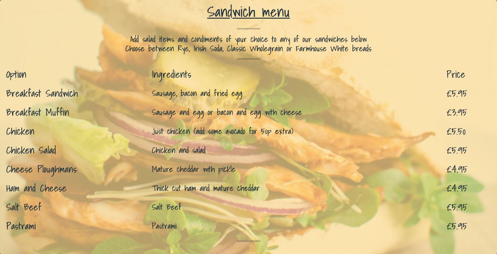
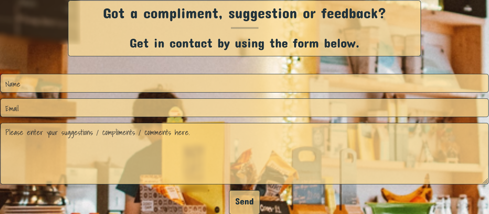

# THE BREAD SHED

- The Bread Shed is the bread and butter of everyones lunch, it is a sandwich shop that sells homemade sandwiches along with snacks and drinks.  
- It is a place where anyone can grab a quick bite to eat for breakfast or lunch.  
- The site is designed so that customers can view the menu and make a decision on what they might like to eat or drink before they arrive at the shop.  
- The customer can also phone their order through so that it is pre-made and ready for them upon arrival at the store.
- The Bread Shed website is designed with ease in mind and is divided into menu pages where the food items are seperated by type.
- The target audience for this website is anyone that is looking for something that is quick and easy to obtain and healthy to eat.
- Included below are two mockup images of The Bread Shed website.

## Mockup Screenshots

| Light | Dark |
| --- | --- |
|  |  |

## UX

- The design was created as a series of wireframes covering mobile, tablet and desktop to outlay the initial design thoughts and layout.  
- It was designed with ease of use in mind and mobile use at the forefront. This is so users can view what is on offer while out and about or not near to a computer.
- Once the wireframe was created, the web pages were built with a clean look and ease of navigation in mind, so you are never more than two clicks from a menu.

### Colour Scheme

- The colours chosen are Peach Yellow (#fbda92) and Gunmetal (#22333b).
- These two colours were chosen as they compliment each other along with the aesthetic of the background image. They are also subtle, easy on the eye and have a good contrasting visiblity with each other.

- `Hex code #fbda92` used for primary text.
- `Hex code #22333b` used for primary highlights.
- `Hex code #fbda92` used for secondary text.
- `Hex code #22333b` used for secondary highlights.
- `Hex code #22333b` used for tertiary text.
- `Hex code #fbda92` used for tertiary highlights.
- `Hex code #22333b` used for borders.
- `Hex code #fbda92ba` used for text backgrounds.
- `Hex code #22333bca` used for footer background.

### Typography

- Two fonts were chosen from Google fonts as follows.

- [Concert One](https://fonts.google.com/?query=concert+one) was used for the primary headers, titles and general text.
This font was chosen for it's bold and rounded aesthetic.

- [Shadows Into Light](https://fonts.google.com/?query=shadows) was used for all menu text and text entry fields.
This font was chosen for it's hand written aesthetic that I wanted to use for the menu items, portraying a hand written menu.

- [Font Awesome](https://fontawesome.com) icons were used throughout the site, specifically as the social media and copyright icons in the footer.

## User Stories

### New Site Users

- As a new site user, I would like to easily understand the main purpose of the site, so that I can learn more about what it has to offer.
- As a new site user, I would like to easily navigate through the site, so that I can easily make a choice from what is on offer.
- As a new site user, I would like to easily see what others think, so that I can decide if what is on offer will suit my tastes.
- As a new site user, I would like to easily be able to see their social media interaction, so that I can see if the have any publicised offers or loyalty schemes.
- As a new site user, I would like to be able to see where the shop is located, so that I can easily collect my order.

### Returning Site Users

- As a returning site user, I would like to find a good selection, so that I can try something different each time.
- As a returning site user, I would like to be able to make contact, so that I can make suggestions or post comments / testimonials.
- As a returning site user, I would like to find good value, so that I can feel satisfied without breaking the bank.
- As a returning site user, I would like to see a wide range of drinks and snacks, so that I can compliment my meal choice.

## Wireframes

- To follow best practice, wireframes were developed for mobile, tablet, and desktop sizes.
- I've used [Balsamiq](https://balsamiq.com/wireframes) to design my site wireframes.

### Home Page Wireframes

| Mobile | Tablet | Desktop |
| --- | --- | --- |
|  |  |  |

### Menu Pages Wireframes

| Mobile | Tablet | Desktop |
| --- | --- | --- |
|  |  |  |

### Contact Page Wireframes

| Mobile | Tablet | Desktop |
| --- | --- | --- |
|  |  |  |

### Confirmation Page Wireframes

| Mobile | Tablet | Desktop |
| --- | --- | --- |
|  |  |  |

### Offcanvas Navbar Wireframes

| Mobile | Tablet | Desktop |
| --- | --- | --- |
|  |  |  |

### Offcanvas About Us Wireframes

| Mobile | Tablet | Desktop |
| --- | --- | --- |
|  |  |  |

## Features

### Existing Features

The following are existing features of The Bread Shed site along with descriptions and screenshots:

- **The Bread Shed Navigation Header**

  - The Bread Shed navigation header utilises the company name as a main link to the home page so whichever page is selected it is possible to navigate back to the home page by clicking on The Bread Shed navigation header. This is made possible by the first link at the top of the responsive navbar on all pages.

- **The Navigation Menu Button**

  - The navigation menu button is located in the top right corner of every page and enables the ability to navigate to any page on the site with two clicks (with exception to the confirmation page which can only be accessed by completing the contact form). The button enables an offcanvas element to scroll in from the right-hand side of the page and has a list of clickable links that navigate to the various pages of the site.

- **The Offcanvas Navigation Menu**

  - The offcanvas navigation menu scrolls in from the right-hand side of the page on all pages when the navigation menu button is clicked. This menu enables access to all pages in two clicks from the links located within. This offcanvas element also displays the store opening times. This utilises a bootstrap card element located within the offcanvas element.

- **The Social Media Links**

  - The social media links located at the bottom of each page utilise Font Awesome 6 icons that have been wrapped in a link so that they are clickable. Each link is directed to it's relevant social media site and opens in a new browser tab so that navigation of the accessed page is not lost. Each social media link is highlighted when hovered over to indicate to the user that it is the one being selected.

- **The Compliments Carousel**

  - The compliments carousel in the lower center of the home page has been designed so that anyone visiting the site can instantly see the compliments left from previous customers. This instills confidence that the place is a reputable and desirable venue providing a great bite to eat for the hungry. The carousel is set to auto play and can be scrolled backward and forward using the arrows at each end if the viewer wants to override the default scroll time.

- **The About Us Offcanvas**

  - The about us off canvas element is triggered by clicking on About Us at the bottom of every page. This enables an offcanvas element to scroll up from the bottom of the page and contains some information about the company. The about us link also changes color when hovered over so the user knows that is what they are about to click to view.

- **The Sandwich Menu**

  -The sandwich menu is where customers are able to view what sandwiches are on offer along with ingredients and prices. They are able to make an informed decision as to what they want in their sandwich and what type of bread to have it on. This menu uses the main background image of a sandwich.

- **The Drinks Menu**

  -The drinks menu is where customers are able to view what drinks are available along with varients and prices. They are able to make an informed decision as to what drink they want to have. This menu has an image of drinks as it's background to compliment it and add some dynamism to the site.

- **The Snacks Menu**

  -The snacks menu is where customers are able view what snacks are avaialble along with varients and price. They are able to make an informed decision as to what snack they want to have. This menu has an image of some cookies as it's background to further compliment it and add another layer of dynamism to the site.

- **The Contact Form**

  -The contact form is located on the contact page and is a means for customers to contact The Bread Shed and leave feedback, suggestions and comments. The customer (if they wish) is required to leave their name, email address and comment before the sumbit button will allow a message to be sent. Once sent the customer is taken to a confirmation page.

- **The Contact Address and Map**

  -The contact address, phone number and map is located on the contact form page underneath the contact form. These details are so that the customer is able to find us and also ring through an order to us. The map is a google interactive map and thus enables the customer to get a better lock on our location.

- **The Confirmation Page**

  -The confirmation page is a hidden page that is only accessed by completeing the contact form and has text thanking the customer for their feedback. This page is an automatic page and is set with a reset timer for 10 secs where it will then redirect back to the home page of The Bread Shed website. All navigation links are active on this page should the customer wish to speed up the return to any of the visible pages on the site. The timer is a meta located in the header of the confirmation page.

### Future Features

The following are future features to be implemented into The Bread Shed site:

- Order Page
  - An order page would be beneficial so that potential customers can place orders online if they are unable to use a phone for any reason. This would also free up the store phone during busy periods enabling orders to be processed quickly and efficiently.
- Payments Page
  - A payment page would be beneficial so that customers that are in a hurry can order and pay all in one go and when ready just collect their order and go.
- Delivery Options
  - A delivery feature would also be a great time saver for those that are unable to leave their home or office.

## Tools & Technologies Used

The following tools were used in the creation of The Bread Shed site:

- [HTML](https://en.wikipedia.org/wiki/HTML) used for the main site content.
- [CSS](https://en.wikipedia.org/wiki/CSS) used for the main site design and layout.
- [Bootstrap](https://getbootstrap.com) used as the front-end CSS framework for modern responsiveness and pre-built components utilising background javascript.
- [Git](https://git-scm.com) used for version control. (`git add`, `git commit`, `git push`)
- [GitHub](https://github.com) used for secure online code storage.
- [GitHub Pages](https://pages.github.com) used for hosting the deployed front-end site.
- [VSCode](https://code.visualstudio.com/) used as a local IDE for development.
- [Krita](https://krita.org/en/) used for cropping and editing the background images and screenshots.

## Testing

For all testing of The Bread Shed, please refer to the [TESTING.md](TESTING.md) file.

## Deployment

The Bread Shed site was deployed to GitHub Pages. The steps involved to deploy The Bread Shed site are as follows:

- In [The Bread Shed GitHub repository](https://github.com/boderg/the-bread-shed), navigate to the Settings tab,
- From the source section drop-down menu, select the **Main** Branch, then click "Save".
- The page will be automatically be refreshed with a detailed ribbon display to indicate the successful deployment.

The live link for The Bread Shed can be found [here](https://boderg.github.io/the-bread-shed).

### Local Deployment

The Bread Shed can be cloned or forked in order to make a local copy on your own system.

#### Cloning

You can clone The Bread Shed repository by following these steps:

1. Go to [The Bread Shed GitHub repository](https://github.com/boderg/the-bread-shed).  
2. Locate the Code button above the list of files and click it.  
3. Select your preferred option to clone using HTTPS, SSH, or GitHub CLI and click the copy button to copy the URL to your clipboard.
4. Open Git Bash or Terminal.
5. Change the current working directory to the one where you want the cloned directory.
6. In your IDE Terminal, type the following command to clone my repository:
    - `git clone https://github.com/boderg/the-bread-shed.git`
7. Press Enter to create your local clone.

Alternatively, if using Gitpod, you can click below to create your own workspace using The Bread Shed repository.

Please note that in order to directly open The Bread Shed in Gitpod, you need to have the browser extension installed.
A tutorial on how to do that can be found [here](https://www.gitpod.io/docs/configure/user-settings/browser-extension).

#### Forking

By forking The Bread Shed GitHub Repository, you make a copy of the original repository on your GitHub account to view and/or make changes without affecting the original owner's repository.
You can fork this repository by using the following steps:

1. Log in to GitHub and locate [The Bread Shed GitHub Repository](https://github.com/boderg/the-bread-shed).
2. At the top of the Repository (not top of page) just above the "Settings" Button on the menu, locate the "Fork" Button.
3. Once clicked, you should now have a copy of the original repository in your own GitHub account!

### Local VS Deployment

No differences have been noted between the local and the deployed pages of The Bread Shed website.

## Credits

The following are credits to various people and technologies that have directly or otherwise assisted in the creation of The Bread Shed site.

### Content

The following content was used in the creation of The Bread Shed site:

| Source | Location | Notes |
| --- | --- | --- |
| [Markdown Builder](https://traveltimn.github.io/markdown-builder) | README and TESTING | tool to help generate the Markdown files |
| [Chris Beams](https://chris.beams.io/posts/git-commit) | version control | "How to Write a Git Commit Message" |
| [Bootstrap](https://getbootstrap.com/docs/5.3/components/navbar/) | entire site | responsive HTML/CSS/JS navbar |
| [Bootstrap](https://getbootstrap.com/docs/5.3/components/carousel/) | home page | autoplaying carousel |
| [Bootstrap](https://getbootstrap.com/docs/5.3/components/offcanvas/) | entire site | offcanvas elements |
| [Bootstrap](https://getbootstrap.com/docs/5.3/components/card/) | entire site | card element |
| [Bootstrap](https://getbootstrap.com/docs/5.3/content/tables/) | menu pages | table element |
| [Bootstrap](https://getbootstrap.com/docs/5.3/forms/form-control/) | contact page | form element |
| [Google Maps](https://goo.gl/maps/LB4WPhpZbBGpvSt1A) | contact page | interactive map |
| [Favicon Generator](https://favicon.io/) | all pages | favicon creation and installation information |
| [Net Informations](https://net-informations.com/q/mis/closed.html) | all pages | removal of cross origin errors |

### Media

The fullscreen hero images used on The Bread Shed site are attributed to the following:

| Source | Location | Type | Notes |
| --- | --- | --- | --- |
| [Unsplash](https://unsplash.com/photos/BXNctQYqPOc?utm_source=unsplash&utm_medium=referral&utm_content=creditCopyText) | home, contact and confirmation pages | image | background image, photo of a sandwich taken by Monteverdo Barnsley |
| [Unsplash](https://unsplash.com/photos/pHeX8H9WQpY?utm_source=unsplash&utm_medium=referral&utm_content=creditCopyText) | sandwich menu page | image | background image, photo of a sandwich taken by Monika Grabkowska |
| [Pexels](https://www.pexels.com/photo/full-filled-drinking-glass-on-table-2827637/) | drinks menu page | image | background image, photo of drinks taken by Shirley Tan |
| [Pexels](https://www.pexels.com/photo/crunchy-butter-cookies-with-chocolate-chunks-9828785/) | snacks menu page | image | background image, photo of cookies taken by Hilal Bülbül |
| [Pexels](https://www.pexels.com/photo/coffee-shop-1833586/) | contact page | image | background image, photo of a coffee / sandwich shop taken by Lisa Fotios |

### Acknowledgements

- I would like to thank my Code Institute mentor, [Tim Nelson](https://github.com/TravelTimN) for their support throughout the development of The Bread Shed.
- I would like to thank the [Code Institute](https://codeinstitute.net) tutor team for their assistance with troubleshooting and debugging some IDE set up issues.
- I would like to thank the [Code Institute Slack community](https://code-institute-room.slack.com) for the support with the implementation of VSCode, Bash and Git to enable me to work locally when the online IDE was running slow.
- I would like to thank my CI facilitator Iris Smok for their effective learning timetables and feedback on The Bread Shed site.
- I would like to thank my family, for believing in me, and allowing me to make this transition into software development.
